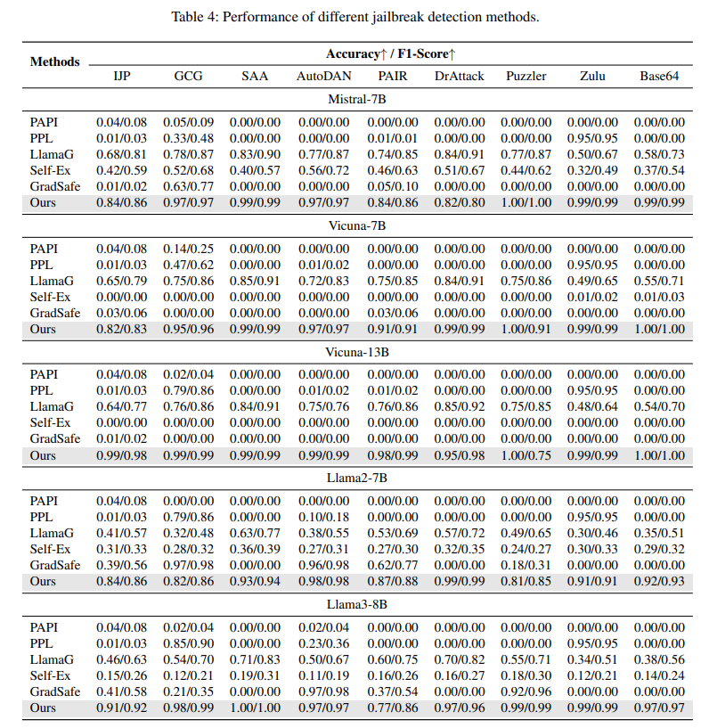

# JBShield: Defending Large Language Models from Jailbreak Attacks through Activated Concept Analysis and Manipulation

This repository includes the data and python implementation for the paper "JBShield: Defending Large Language Models from Jailbreak Attacks through Activated Concept Analysis and Manipulation." (Accepted by the 34rd USENIX Security Symposium 2025).

[](https://arxiv.org/abs/2502.07557) [](https://opensource.org/licenses/MIT)


Note: The experimental results presented in this artifact may exhibit some variations due to differences in testing environments, the randomness in calibration set selection, and dataset size discrepancies across different jailbreak methods (DrAttack and Puzzler contain fewer samples compared to others). Despite these variations, the overall trends and effectiveness of `JBShield` remain stable, as demonstrated by the extensive evaluations conducted in our study.

## Requirements

The minimum hardware requirement is two GPUs with at least 24GB VRAM each (e.g., RTX 3090 or RTX 4090). For optimal performance, we recommend a setup with 4 RTX 4090 GPUs (24GB VRAM each) or 1 A100 GPUs (80GB VRAM each). 

The code for `JBShield` runs with Python 3 and requires Pytorch. We recommend using `Anaconda` or `miniconda` for python. Our code has been tested with `python=3.12.8` and `torch=2.5.1` on linux. First, create a conda environment activate it:

```shell
conda create -n jbshield python=3.12
conda activate jbshield
```

Please follow [this](https://pytorch.org/get-started/locally/) to install Pytorch and `pip install` the following packages:

```shell
python -m pip install transformers fschat pandas accelerate nltk sentencepiece scikit-learn protobuf
```

## Our Dataset

Our dataset is located in `./data`. The jailbreak prompts are located in `./data/jailbreak`, while the harmful and harmless prompts can be found in `./data/harmful{}.csv` and `./data/harmless{}.csv`, respectively. 

We randomly divided the data into calibration and test sets. The calibration data is located in `./data/jailbreak/{jailbreak_name}/{model_name}_calibration.json`, while the test data can be found in `./data/jailbreak/{jailbreak_name}/{model_name}_test.json`.

## Model Preparation

We selected five target LLMs and one judge LLM, as detailed in the table below:

| Model name                                     | Link                                                         |
| ---------------------------------------------- | ------------------------------------------------------------ |
| Mistral-7B-Instruct-v0.2                       | [[Huggingface link]](https://huggingface.co/mistralai/Mistral-7B-Instruct-v0.2) |
| Llama-2-7b-chat-hf                             | [[Huggingface link]](https://huggingface.co/meta-llama/Llama-2-7b-chat-hf) |
| Meta-Llama-3-8B-Instruct                       | [[Huggingface link]](https://huggingface.co/meta-llama/Meta-Llama-3-8B-Instruct) |
| vicuna-7b-v1.5                                 | [[Huggingface link]](https://huggingface.co/lmsys/vicuna-7b-v1.5) |
| vicuna-13b-v1.5                                | [[Huggingface link]](https://huggingface.co/lmsys/vicuna-13b-v1.5) |
| ft-mistral-7b-instruct-v0.2-sorry-bench-202406 | [[Huggingface link]](https://huggingface.co/sorry-bench/ft-mistral-7b-instruct-v0.2-sorry-bench-202406) |

Mistral, LLaMA-2, LLaMA-3, Vicuna-7B, and Vicuna-13B are the target models in our evaluation. Run the following shell commands to download models:

```shell
cd models
chmod +x ./download_models.sh
./download_models.sh
```

Place the models in the `./model`, structured as follows:

```
./models
├── Llama-2-7b-chat-hf
├── Meta-Llama-3-8B-Instruct
├── Mistral-7B-Instruct-v0.2
├── ft-mistral-7b-instruct-v0.2-sorry-bench-202406
├── vicuna-13b-v1.5
└── vicuna-7b-v1.5
```

## Interpretation

We provide the code and results for concept analysis on five target LLMs. Run the following shell commands to extract concept-related tokens:

```shell
chmod +x ./interpret.sh
./interpret.sh
```

The results are saved in `./interpret_results` (see Table 2 and Appendix A in our paper).

## JBSHield-D

Run the following commands to evaluate the jailbreak detection performance of `JBShield-D` on the five LLMs:

```shell
chmod +x ./evaluate_detection.sh
./evaluate_detection.sh
```

The results are saved in `/logs/JBShield-D_{model_name}.log`. We have also provided the logs from our runs in the same directory.

Performance (accuracy/F1-score) of `JBShield-D` across different LLMs (see Table 4 in our paper):



## JBSHield-M

Run the following commands to evaluate the jailbreak mitigation performance of `JBShield-M` on the five LLMs:

```shell
chmod +x ./evaluate_mitigation.sh
./evaluate_mitigation.sh
```

The results are saved in `/logs/JBShield-M.log`. We have also provided the logs from our runs in the same directory.

Performance (attack success rate) of `JBShield-M` across different LLMs (see Table 7 in our paper):


## Citation

If you find this helpful, please cite our work:

```tex
@misc{zhang2025jbshield,
      title={JBShield: Defending Large Language Models from Jailbreak Attacks through Activated Concept Analysis and Manipulation}, 
      author={Shenyi Zhang and Yuchen Zhai and Keyan Guo and Hongxin Hu and Shengnan Guo and Zheng Fang and Lingchen Zhao and Chao Shen and Cong Wang and Qian Wang},
      year={2025},
      eprint={2502.07557},
      archivePrefix={arXiv},
      primaryClass={cs.CR}
}
```
